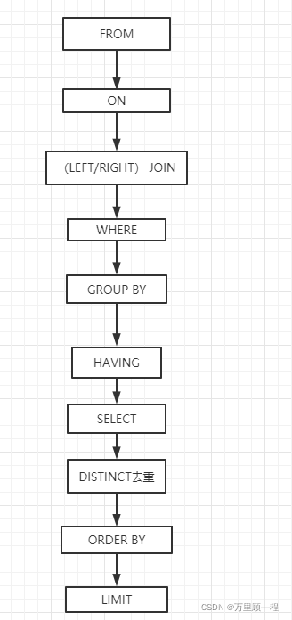
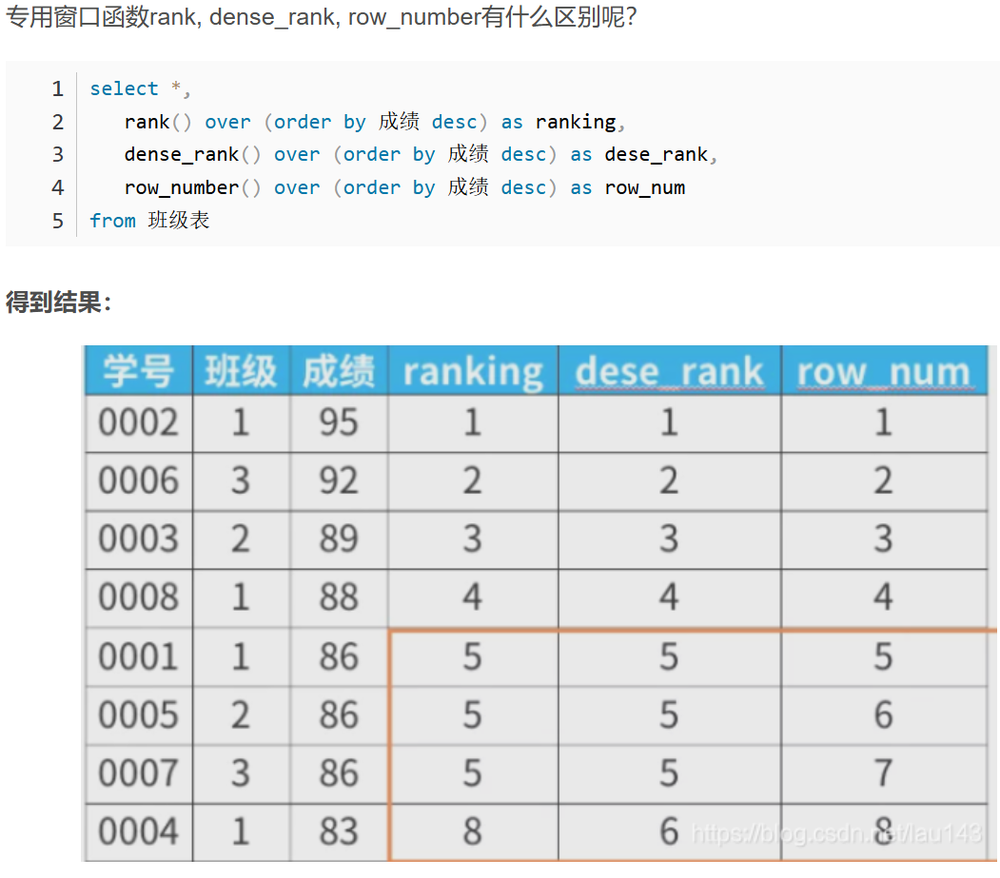

# 一、SQL结构
## 1. <mark>**顺序**<mark>
**FROM>WHERE>GROUP BY>HAVING>SELECT>ORDER BY>LIMIT**


往往由于WHERE是最先开始的 所以一般后面出现的定义别称、聚合函数等 不应该放在这里面 否则出现找不到该定义的情况  

## 2. HAVING和WHERE的用法区别（结合顺序解释）
HAVING 是WHERE关键字无法和聚合函数一起使用就比如SUM()等  
还需要注意就算有的改了别称的聚合函数也是要用HAVING的。  
先从表里面获取数据，获取到表的信息之后再限定条件WHERE，然后再对这些数据进行整合比如（GROUP BY），HAVING是聚合函数的使用语句，如果要是没有聚合就会报错 所以GROUP BY 和HAVING  应该是成对出现的。  
然后剩下的再筛选数据 比如SELECT 然后再排序 排序完了最后是限制LIMIT  
**总的顺序为：
FROM->WHERE->GROUP BY->HAVING->SELECT->ORDER BY->LIMIT**  
<ins>但是虽然GROUP BY 在逻辑上先行于SELECT语句，但是在实际应用中SQL会允许GROUP BY 中引用select的别名</ins>  
如：
https://leetcode.cn/problems/monthly-transactions-i/?envType=study-plan-v2&envId=sql-free-50  

**HAVING 只用于聚合函数的应用 没有其他的应用**  

## 3. WHERE 的用法 
因为是先FROM 再然后是WHERE  
**那么FROM 如果连接的表中有null值的行 那么直接就会被过滤掉**  
如果不想被过滤掉 那么就加入进连接表中的AND语句  
因为AND起着一个局部过滤的作用  
## 4. 创建常量列
**语法：SELECT '固定值' AS 列名**  
用于分类标签等场景  


---
# 二、相关概念
## 1. 视图
**语法**：CREATE VIEW viewname 
SELECT column1,column2... FROM table WHERE XXX
就相当于指定让你看什么东西  
在一定程度上保护了数据的隐秘性  
**视图本身是一个SQL查询语句，只有你打开它时才会查询到相关数据，不打开就没有，就相当于一个调用接口可以理解为**  
此外，**一般将视图视作是检索SELECT而不是增删改，这样会破坏表的基础性**

# 三、增删改查语句
## 1. DELETE 
**删除单表内容的语法**：DELETE FROM table WHERE xxx  
**删除连表内容的语法**：DELETE T1 FROM T1 JOIN T2 ...  
<mark>这里指的是对T1进行的操作，而不是对T1和T2一起的操作，可以视作后面的JOIN 包括WHERE 都是在筛选条件，最后再反馈到T1表上进行删除<mark>  

DELETE 不删除表本身而只删除表的内容  
如果想要快速删除表本身 那么使用TRUNCATE table则表示重新建立一个表  
见题：https://leetcode.cn/problems/delete-duplicate-emails/

### <MARK>GROUP BY<MARK>
1. Group by 如果有多列那么将在最后的列上进行汇总
2. 在子句中不能含有聚合类型的函数（详见SQL语句先后顺序）
3. GROUP BY 是对子句中的列建立了分组，分组的意思就是指定列都一起计算，所以呢就不能从单独的列中取出单独的数据 
也就是可以理解为Excel表中的分组显示功能一样 只有一个总的 
4. GROUP BY column1,column2<可以是列名，也可以是列的序号如：1、2...>  
   这样的情况是必须要同时满足这两列(c1,c2)是一组存在关系      
<mark>对于非分组列,必须使用聚合函数（MIN()、MAX()、AVG())<mark>

# 四、子查询
原来还可以在表达式中添加查询语句：  
```sql
SELECT R.contest_id, 
ROUND((COUNT(R.user_id)/(SELECT COUNT(U.user_id) FROM Users U))*100,2) percentage
FROM Users U 
JOIN Register R 
ON U.user_id = R.user_id  
GROUP BY R.contest_id
ORDER BY percentage DESC,contest_id 
```

## **连接（内连、外连等）**
https://blog.csdn.net/ysmintor_/article/details/99694870

### Inner join
取的是交集
### Left join
取的是左边表的所有值
### Right join
同Left join
### Full/Outer join
取的是并集，两个表**互相不存在**的那么就赋值为null
### Union
Union就是将列累加起来 形成一个整体的一列  
但是Union内部的SELECT语句列数一定相同，数据类型也是  
呈现的是不重复的
### Union all
是将所有的值都呈现，不管有没有重复
### CROSS JOIN
将两张表相乘  
https://www.cainiaojc.com/sql/sql-cross-join-operation.html  
**相关题目**：  
https://leetcode.cn/problems/students-and-examinations/description/

<ins><mark>需要注意的是on的条件是很灵活的:
1. 它也可以是不同条件的连接
2. 它也可以是一张表中重复多次但另一张表只有一次的连接，只要能对应上即可，其中一张表将依据连接条件进行一一匹配 所以跟条件出现次数无关</mark></ins>

---

## <mark>取数 LIMIT OFFSET<mark>
### LIMIT的意思就是取出来多少条 数字多少就是代表取多少 
### LIMIT m,n 表示从m+1开始取出n条数据
### LIMIT n: 从0开始取出n条数据(0，n)

查询第多少条数据的时候比如第二条数据，为1，eg:  
SELECT * FROM TABLEA LIMIT 1,1 ——>表示第二条数据  
SELECT * FROM TABLEA LIMIT 1,2 ——>表示第二条、第三条的数据  
...
如果是查询前多少条的时候：  
SELECT * FROM TABLEA LIMIT 0,2 ——>表示查询前两条的数据 所以这里计数应该是从0，取出0和1，相当于python取列表时候的前闭后开  

### OFFSET n 去掉第n个值
跳过n条数据，取n+1条值  
SELECT * FROM TABLEA LIMIT 3 OFFSET 1  
表示offset 1从第二条开始取三条LIMIT 3  

### 这个TOP N 针对的是SQL Server而非Mysql语言 这个要注意

---
# 运算符
## 排除的运算符语法为 ！=、not like、not in (xx)、<> 彼此是互相等同的  
## **但是注意了，以上运算符遇到 null 其实在sql中是错的，因为null值不能被当做一个正常的值来使用，这样任何判断碰上它都会变成null 比如 =、<、>、<>、not in**
<mark>所以遇到null值就需要用到 IFNULL或者is (not) null来进行判断</mark>  
如一张表中本来就有null值 如果以not in 的时候就相当于对NULL本身画上了运算符 ——> ！= null ——> 返回false  


## BETWEEN AND 指的是前闭后闭
## NOT IN 一般指的是行（一行或多行均可）而不是列
eg.就比如去掉最大值和最小值，然后求取剩下的平均工资，那么我们一般会设想在
salary not in (select max(salary),min(salary) from table a) 但是这返回的是两列，而不是两行


---

# 条件判断语句
## IF语句
IF(expr,result_true,result_false)  
有时候要用IF语句来判断,这样就不会想到会用什么子查询了：    
https://leetcode.cn/problems/queries-quality-and-percentage/description/?envType=study-plan-v2&envId=sql-free-50
## IFNULL(expr1,expr2)
如果IFNULL中的expr1是空值null,那么就返回expr2，如果不是空值那么就返回它自身

## NULLIF(expr1,expr2)
若expr1 = expr2 那么就返回null,否则返回expr1

## ISNULL(expr)
如果expr是null，那么返回1，否则就返回0
## CASE WHEN ELSE
CASE XX
    WHEN XXX THEN XXX
    ELSE XXX
    END;  
    这个是按照when的先后顺序来的 如果满足第一个when就不会执行后面的when了  
#### 这个可以直接写在表达式中 不用打括号
# NULL IF
NULLIF确保不为空值
eg.NULLIF(COUNT(qd),0)
若为空值就会产生返回为0

# 函数
## **<mark>窗口函数<mark>** 
<窗口函数> over (partition by <用于分组的列名>  
order by <用于排序的列名>  
rows/range子句<用于定义窗口大小> )  
**是对全局进行操作**
窗口函数一般与函数公用，如排序函数、聚合函数
### 1. 专用窗口函数：rank、dense_rank、row_number等
### 2. 聚合函数：sum、avg、count、max、min
#### 聚合函数用法
1. 在AVG()写法中会有一种 条件判断语句，例如：     
AVG(rating<3)  等价于 AVG(IF(rating<3,1,0))  
这种逻辑也可以适用于其他函数中  
2. COUNT vs. SUM  
<mark style="background-color:#FF69B4">**COUNT是计算非空行的**，也就是说只要不为NULL，那么所有的什么1，0，各种描述都会算入其中，即便用了IF语句 不为1就是0，这样的结果也会返回所有值的    
SUM是计算1，0那些数字的累加的</mark>  
3. MAX()这一类的聚合函数 如果不存在 那么会自动返回null的


常见出题就会有**求取第一次的时间、最早的**等等诸如此类的描述，一般会有MIN GROUP BY 的搭配
### 3. 其他函数：位移函数 (LEAD、LAG)
语法：
**<窗口函数> OVER (PARTITION BY <用于分组的列名> ORDER BY <用于排序的列名>)**  
但是ORDER BY 其实还有一个隐藏的效果，就是在使用的过程中，它会自动添加默认的窗口框架 针对于聚合函数：  
```SQL
RANGE BETWEEN UNBOUNDED PRECEDING AND CURRENT ROW
```
意思是从分区开始——>当前行
所以...  
有OREDER BY 就是求取全局的那个函数  
如果没有 那就是求取局部的那个函数  


### 专用窗口函数——**排序函数**
#### RANKING() 对于分数相同的排序号码会一致 但是下一个排序号码则会累计相同分数的数量
#### DENSE_RANK() 对于分数相同的排序号码也是一致的，但不累计数量
#### ROW_NUM() 不管分数相同与否，都依次按照排序号码排列下来
具体见图所示：


### **位移函数**
#### LEAD(column_name,offset,default 1) OVER ()
从当前行往下看  
#### LAG(column_name,offset,default 1) OVER ()
从当前行往上看（回头看） 往前面看一行    

**相关连续、首个等题目链接**：  
<mark>180 连续出现的数字</mark>  
LEAD()解题：  
https://leetcode.cn/problems/consecutive-numbers/  

**550 游戏玩法分析**  
https://leetcode.cn/problems/game-play-analysis-iv/description/

 
# 滑动窗口函数
<窗口函数> over (partition by <用于分组的列名>  
order by <用于排序的列名>  
rows/range子句<用于定义窗口大小> )  
滑动窗口函数详解：  
https://blog.csdn.net/WHYbeHERE/article/details/127896098  
**RANGE INTERVAL N DAY PRECEDING == RANGE BETWEEN INTERVAL N DAY PRECEDING AND CURRENT ROW**  
  
注意：如果数据没有比如规定的前几行数据 仍旧会返回已有数据行  
相关试题：  
https://leetcode.cn/problems/restaurant-growth/description/?envType=study-plan-v2&envId=sql-free-50  

## **日期函数**
1. 时间戳——>日期
from_unixtime(time,'yyyy-MM-dd') as time  
time:1627963699  
转换结果：2021-08-03之类的  
2. 日期——>时间戳  
from_timestamp('2021-08-03','yyyy-MM-dd') as time  
3. 截取年月日
year('2021-08-03')——>2021  
**4. 时间差计算**  
datediff(date1,date2) ->date1-date2
datediff 计算日期之间的天数间隔  
datediff('2021-08-10','2021-08-03')
date1>date2 返回正数
否则为负数
5. date_sub 减少多少天 在给出的数值基础上减少  
**date_sub**('2021-08-10',interval 8 day)  
减少多少天之后的日期  
'2021-08-02'  
6. date_add 增加多少天
**date_add**('2021-08-03',interval 8 day)  
往前增加的天数  
'2021-08-11'  
7. 格式化时间 date_format()
**DATE_FORMAT(date,format)**
**format常用的是："%Y-%m-%d"、"%H:%i:%s"**   

## 其余函数
### 1. mod(nExp1,nExp2) 
用于返回exp1的余数  
比如mod(7,2) 余数为1  
### 2. GREATEST(value1,value2...) LEAST(value1,value2)
MAX()是用来算列值最大的 那么行值最大怎么计算呢？  就用到以上函数了
### 3. COALESCE
COALESCE是一个函数， (expression_1, expression_2, ...,expression_n)  
依次参考各参数表达式，遇到非null值即停止并返回该值。  
eg.COALESCE(email, phone, '无联系方式')  
email 不为空则返回email 为空则返回phone 依次这样下去  
它与IFNULL的区别是 可以处理多列的值  
而IFNULL 只能处理一列的值


## SQL字符串函数
详情参考以下网站：  
https://www.w3cschool.cn/sql/sql-string-functions.html  
常用到的函数：  
1. CONCAT(STR1,STR2...) 连接  
2. SUBTRING()
``` sql 
SUBSTRING(str,pos):
SUBSTRING('love you',3)
've you'
SUBSTRING (STR FROM POS)
SUBTRING('RED' FROM 2)
'ED'
SUBSTRING（STR，POS，LEN）
SUBSTRING('China',1,3)
'Chi'

```
3. LEFT(str,len) right(str,len)
   分别代表从左边取多少 从右边取多少(len)  

### 字段切割
1. substring_indx(VALUE,符号等,符号的位置)
符号的位置 如果是2 表示返回前两个字符串
如果是-1 表示返回最后一个字符串
1. GROUP_CONCAT()与GROUP BY连用就省去了一个一个的CONCAT()的操作  
``` sql
group_concat([distinct] 字段名 [order by 排序字段 asc/desc] [SEPARATOR'分隔符'])
```  
# SQL中的字符位置是从1开始计数的
substr(VALUE,截取位置（闭区间),截取位置结束)
# 字符串长度 length()
# 删除 trim
trim(需要删除的字符串 from VALUE)


# 条件语句
## CASE WHEN ELSE
CASE XX
    WHEN XXX THEN XXX
    ELSE XXX
    END;

## IF(expression, result_ture, result_false)  
<mark style="background-color: 	#FF69B4">这个只能用于SELECT语句中</mark>    
## IFNULL(expr1,expr2)
判断表达式1是否为空值，如果是则返回表达式2，否则就返回它自身(null)
## NULLIF（expr1,expr2)
如果expr1 == expr2 则返回null,否则就返回expr1
## ISNULL(expr)
如果expr是null 返回1 否则返回0  

# 正则表达式
regexp | rlike
参考这个：  
https://www.runoob.com/mysql/mysql-regexp.html  
常见的：  
1. \w == [a-zA-Z0-9_] 表示大小写字母或数字或下划线
2. '.'表示匹配任意字符  
   但是如果只表示 '.' 需要加入转义符\\  
   在[]中不需要加转义符  
3. ^表示开头 $表示结尾  


